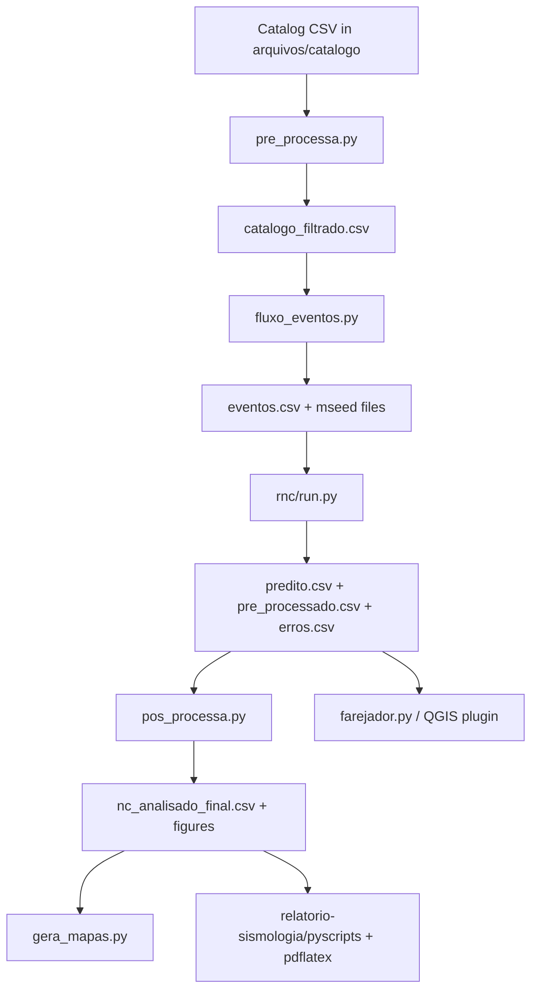

# Architecture

**Pattern:** Script-driven data pipeline with file-based stage contracts + optional desktop/QGIS interface and LaTeX reporting.

## High-Level Structure

## Identified Patterns

### 1. Pipeline Orchestration via Bash

- **Location:** `fluxo_sismo.sh`
- **Purpose:** Central entrypoint for end-to-end processing.
- **Implementation:** Feature flags (`--eventos`, `--pre`, `--predict`, `--pos`, `--maps`, `--report`, `--test`) gate each stage.
- **Example:** Sequential invocation of `pre_processa.py` -> `fluxo_eventos.py` -> `rnc/run.py` -> `pos_processa.py`.

### 2. CSV and File-System Contracts Between Stages

- **Location:** `arquivos/*` directories
- **Purpose:** Loose coupling between modules by exchanging persisted artifacts.
- **Implementation:** Each stage reads and writes known CSV and media files.
- **Examples:**
  - Input catalog: `arquivos/catalogo/*.csv`
  - Event output: `arquivos/eventos/eventos.csv`
  - Model output: `arquivos/resultados/predito.csv`
  - Analysis output: `arquivos/resultados/nc_analisado_final.csv`

### 3. Event-Centric Waveform Storage

- **Location:** `arquivos/mseed/<event-id>/`
- **Purpose:** Organize downloads by event and station.
- **Implementation:** Event folder naming by origin time (`YYYYMMDDTHHMMSS`), per-station files in MiniSEED.
- **Example:** Path written in `fluxo_eventos.py`: `Event/Network_Station_Event.mseed`.

### 4. Script Modules with Heavy In-File Logic

- **Location:** `fonte/analise_dados/pos_processa.py`, `fonte/nucleo/fluxo_eventos.py`
- **Purpose:** Keep full transformation logic in one executable module.
- **Implementation:** Many helper functions + single `main()` inside same file.
- **Example:** `pos_processa.py` (~1809 lines) performs loading, feature engineering, grouping, plotting, and CSV export.

### 5. Dual User Interface Strategy

- **Location:** `fonte/interface/farejador.py` and `fonte/interface/farejadorsismo/*`
- **Purpose:** Inspect picks/events manually.
- **Implementation:**
  - Standalone PyQt app (`farejador.py`)
  - QGIS dock widget plugin (`farejadorsismo_dockwidget.py`)
- **Example:** Plugin reads analyzed CSV, creates in-memory QGIS layers (`Eventos`, `Estacoes`), and opens waveforms.

### 6. Reporting as Post-Pipeline Renderer

- **Location:** `fonte/relatorio-sismologia/pyscripts/*`, `fluxo_sismo.sh`
- **Purpose:** Convert processed outputs to publication/report format.
- **Implementation:** Python scripts generate `.tex` fragments from CSV/images, then `pdflatex` compiles report.

## Data Flow

### Flow A: Catalog to Event Waveforms

1. `pre_processa.py` filters catalog by time and Brazil geometry/buffer.
2. `fluxo_eventos.py` fetches event metadata and picks from FDSN.
3. For each valid P-pick, waveform windows are downloaded and persisted to MiniSEED.
4. Event and error rows are exported to CSV.

### Flow B: Event Waveforms to Classification

1. `rnc/data_process.py` decimates/triggers/FFT and saves spectrogram `.npy`.
2. `rnc/prediction.py` loads trained `.h5` model and predicts per pick/event.
3. Outputs are written to `arquivos/resultados/predito.csv`.

### Flow C: Classification to Analysis/Maps/Reports

1. `pos_processa.py` computes quality and probability statistics and saves analyzed outputs.
2. `gera_mapas.py` renders map products.
3. Report scripts transform final CSV/figures into TeX and compile PDF.

## Code Organization

**Approach:** Domain-oriented folders by pipeline responsibility.

- `fonte/analise_dados`: pre/post processing and plotting
- `fonte/nucleo`: data acquisition and shared constants
- `fonte/rnc`: neural inference and data extraction
- `fonte/interface`: standalone and QGIS visual interfaces
- `fonte/relatorio-sismologia`: report generation stack

## Module Boundaries

- Boundaries are mostly file and folder based, not package-API based.
- Shared state is persisted in files, not service interfaces.
- Cross-module coupling occurs through:
  - hardcoded paths
  - expected CSV column names
  - naming conventions for event folders/files

